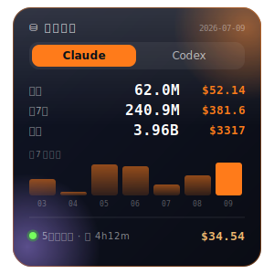

# ccusage 桌面卡片

Claude Code + Codex token 用量的 macOS 桌面卡片(Übersicht widget)。液态玻璃风,可拖动,Tab 切换 agent,含今日/近7天/累计 + 7天趋势图 + 5小时会话。

<p align="center"></p>

> English README below · [English ↓](#english)

## 快速安装(任何 Mac)

```bash
git clone https://github.com/calitty/ccusage-widget.git
cd ccusage-widget
bash install.sh
```

脚本会自动装好 Übersicht、node、ccusage,并部署 widget。

## 📱 iPhone 桌面小组件

也能做成 iOS 桌面卡片(Scriptable + iCloud,免服务器/免上架)。见 [mobile/README.md](mobile/README.md)。

## 手动安装(如果不想跑脚本)

```bash
brew install --cask ubersicht          # 桌面 widget 框架
npm i -g ccusage                       # 用量统计 CLI (需先有 node)
cp ccusage.jsx "$HOME/Library/Application Support/Übersicht/widgets/"
open -a "Übersicht"
```

## 说明

- **数据是每台机器本地的**:ccusage 读本机 `~/.claude` 和 codex 日志,不联网、不同步。新电脑只显示该机的用量。
- **看不到卡片**:菜单栏 Übersicht 图标 → Refresh All Widgets;首次启动如弹权限框,允许即可。
- **改样式**:直接编辑 `ccusage.jsx`,保存自动热重载。颜色在文件顶部 `COLORS`;位置在 `className` 的 `top/right`(或直接拖动,位置记忆在 localStorage)。
- **Intel Mac 也兼容**:widget 命令里的 PATH 同时包含 `/opt/homebrew/bin`(Apple Silicon)和 `/usr/local/bin`(Intel)。

---

## English

A macOS desktop card (Übersicht widget) for **Claude Code + Codex** token usage. Liquid‑glass style, draggable, tab‑switch between agents; shows today / last 7 days / all‑time + a 7‑day trend chart + the active 5‑hour session.

### Quick install (any Mac)

```bash
git clone https://github.com/calitty/ccusage-widget.git
cd ccusage-widget
bash install.sh
```

The script installs Übersicht, node and ccusage, then deploys the widget.

### Manual install

```bash
brew install --cask ubersicht          # desktop widget host
npm i -g ccusage                       # usage CLI (needs node)
cp ccusage.jsx "$HOME/Library/Application Support/Übersicht/widgets/"
open -a "Übersicht"
```

### Notes

- **Data is local per machine.** ccusage reads this machine's `~/.claude` and Codex logs — nothing is uploaded or synced. A new computer only shows its own usage.
- **Card not visible?** Click the Übersicht menu‑bar icon → Refresh All Widgets. Allow the permission prompt on first launch.
- **Customize:** edit `ccusage.jsx` (hot‑reloads on save). Colors are in `COLORS` at the top; position is `top/right` in `className`, or just drag it (position is remembered in localStorage).
- **Intel Macs supported:** the widget's `PATH` includes both `/opt/homebrew/bin` (Apple Silicon) and `/usr/local/bin` (Intel).

MIT licensed.
